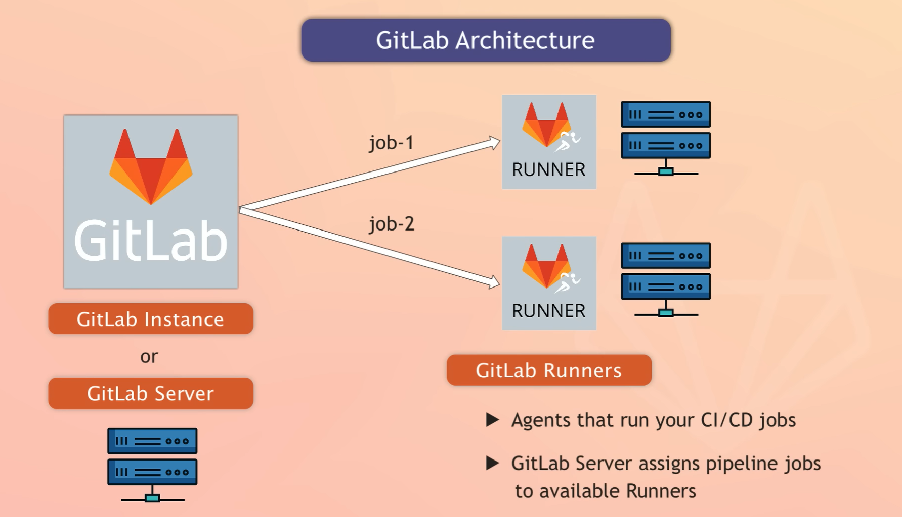

### **What is GitLab**
GitLab is a web-based platform that provides a set of tools for version control, continuous integration/continuous deployment (CI/CD), and collaboration on software development projects. It is commonly referred to as a Git repository management system.

GitLab offers features similar to other Git hosting platforms like GitHub, but with additional functionalities. It allows developers to create and manage Git repositories, track changes in source code, collaborate with other team members, and automate the software development lifecycle.

Here are some key features of GitLab:

- **Version Control**: GitLab utilizes Git, a distributed version control system, allowing developers to track changes, create branches, merge code, and manage the entire history of a project's source code.

- **Web-based Interface**: GitLab provides a user-friendly web interface that allows developers to manage repositories, create and review merge requests, and perform various administrative tasks.

- **CI/CD Pipelines**: GitLab integrates robust continuous integration and continuous deployment capabilities. It enables developers to automate the build, test, and deployment processes, making it easier to maintain software quality and deliver updates efficiently.

- **Issue Tracking and Project Management**: GitLab includes an issue tracking system that allows teams to create, assign, and manage tasks, bugs, and feature requests. It also provides project management features like milestone tracking, boards, and time tracking.

- **Collaboration and Code Review**: GitLab offers features for team collaboration and code review. Developers can comment on code changes, suggest improvements, and have discussions within merge requests to ensure code quality and collaboration.

- **Container Registry**: GitLab provides a built-in container registry to store and manage Docker images, enabling easy deployment and sharing of containerized applications.

- **Wiki and Documentation**: GitLab includes a wiki feature where teams can document their projects, share knowledge, and maintain project-related documentation.

GitLab comes in different editions, including a free Community Edition (CE) with essential features, and a more advanced Enterprise Edition (EE) with additional functionality and support for large-scale enterprise environments. Additionally, GitLab can be self-hosted on-premises or used through GitLab's cloud-based SaaS platform.

#### **What is difference between GIT and GITLAB ?**
Git and GitLab are related but serve different purposes. Here's a breakdown of the key differences between Git and GitLab:
1. Git: Git is a distributed version control system. It is a software tool used for tracking changes in source code during software development. Git allows developers to create repositories, manage branches, track changes, merge code, and collaborate with others. It focuses on the core functionality of version control and provides the basic commands and operations necessary to manage source code history.
   
2. GitLab: GitLab, on the other hand, is a web-based platform that provides a set of tools for version control, collaboration, and continuous integration/continuous deployment (CI/CD) on top of Git. It is a complete DevOps platform that extends Git's functionality and integrates additional features to support the entire software development lifecycle.
   
Some key differences between Git and GitLab are:  
• Functionality: Git focuses solely on version control, whereas GitLab expands on Git's functionality by providing features for project management, issue tracking, code review, collaboration, CI/CD pipelines, and more.
• Web Interface: Git itself is a command-line tool, and it lacks a graphical interface. GitLab, on the other hand, offers a web-based interface that makes it easier to manage repositories, collaborate with team members, and access various project-related features.
• Collaboration: While Git provides basic collaboration features like branching and merging, GitLab enhances collaboration by enabling team members to review code, comment on changes, track issues, and work together on projects more efficiently.
• CI/CD: Git does not have built-in CI/CD capabilities. GitLab integrates robust CI/CD pipelines that allow for automated testing, building, and deploying software. This integration streamlines the development process and ensures the software is continuously integrated, tested, and deployed.
• Project Management: GitLab provides project management features like issue tracking, milestone tracking, boards, time tracking, and documentation management. These features help teams organize and manage their projects effectively.

In summary, Git is the version control system itself, while GitLab is a platform built on top of Git that extends its functionality by adding collaboration, project management, and CI/CD features, making it a comprehensive DevOps solution for software development teams.

### **What is GitLab Architecture**
GitLab has a distributed architecture that consists of multiple components working together to provide its functionality. Here is an overview of the key components of GitLab's architecture:  
1. Application Layer: The application layer is responsible for handling user requests and providing the web interface and API endpoints. It handles user authentication, authorization, and session management. This layer also includes features like issue tracking, code review, and project management.
   
2. Database: GitLab uses a relational database (such as PostgreSQL or MySQL) to store application data, including user information, project metadata, issue tracking, and configuration settings.
   
3. Git Repository Management: GitLab uses Git as the version control system to manage source code repositories. Each project has its own Git repository, and GitLab provides the necessary functionality to interact with Git repositories, such as creating branches, merging code, and tracking changes.
   
4. GitLab Shell: GitLab Shell is a lightweight SSH server that handles the Git authentication and authorization process. It also manages the Git hooks required for certain actions, like enforcing code quality checks before accepting changes.  
   
5. Object Storage: GitLab supports various object storage systems (such as Amazon S3 or Google Cloud Storage) to store large binary files and artifacts associated with projects, including Docker images, build artifacts, and attachments.
   
6. CI/CD Runners: GitLab CI/CD runners are responsible for executing the continuous integration and deployment pipelines defined in the GitLab configuration. Runners can be installed on separate machines or be provided as shared resources by GitLab.com for SaaS users. They execute jobs defined in the pipelines, running tests, building artifacts, and deploying applications.
   
7. Load Balancer: GitLab can be configured with a load balancer to distribute incoming requests across multiple instances of the application layer. This helps improve scalability and handle high traffic loads.
   
8. Reverse Proxy: GitLab recommends using a reverse proxy (such as NGINX) to handle incoming requests, terminate SSL/TLS connections, and cache static assets, reducing the load on the application layer.
   
9.  Monitoring and Logging: GitLab provides monitoring and logging capabilities to track the performance and health of the system. This includes monitoring system metrics, application logs, and error tracking.
    
It's worth noting that GitLab is an open-source platform, which means you have the option to host and customize your own instance of GitLab using the provided architecture or use GitLab's cloud-based SaaS platform for a hosted solution.

### **What is CI/CD ?**

CI/CD stands for Continuous Integration/Continuous Delivery or Continuous Deployment. It is a method used in software development to frequently deliver apps to customers by introducing automation into the stages of app development. 

The main concepts attributed to CI/CD are continuous integration, continuous delivery, and continuous deployment. CI/CD is a solution to the problems integrating new code can cause for development and operations teams.   
Specifically, CI/CD introduces ongoing automation and continuous monitoring throughout the lifecycle of apps, from integration and testing phases to delivery and deployment.  

Taken together, these connected practices are often referred to as a "CI/CD pipeline" and are supported by development and operations teams working together in an agile way with either a DevOps or site reliability engineering (SRE) approach. 

CI/CD automates much or all of the manual human intervention traditionally needed to get new code from a commit into production, encompassing the build, test (including integration tests, unit tests, and regression tests), and deploy phases, as well as infrastructure provisioning.   

By automating integration and delivery, CI/CD lets software development teams focus on meeting business requirements while ensuring code quality and software security. CI/CD is an essential part of DevOps and any modern software development practice.

CI Pipeline:
- Build
- Code Quality
- Tests
- Packages

CD Pipeline:
- Review/Test
- Staging
- Production

